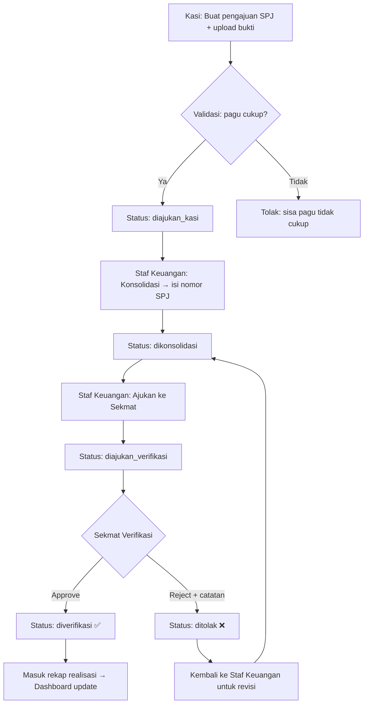
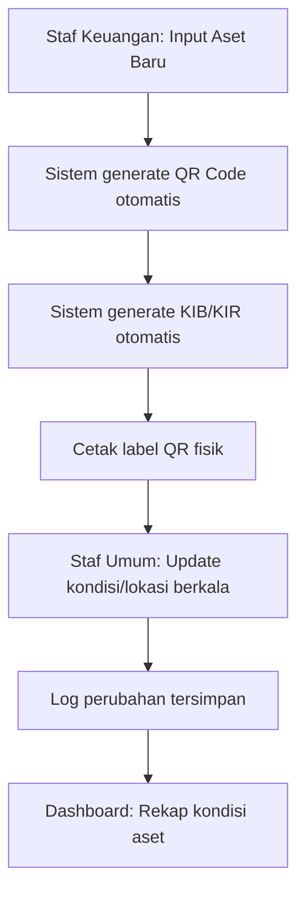

# SIKEMAS
### Sistem Informasi Keuangan dan Aset Terintegrasi — Kecamatan Caringin
**Dokumen Rancangan & Instruksi Pengembangan Lengkap (Siap Pakai untuk AI Coding Assistant)**

---

## 1. Ringkasan Proyek

| Item | Detail |
|---|---|
| Nama Aplikasi | SIKEMAS |
| Instansi | Kecamatan Caringin |
| Acuan | RAP SI-MASKET (Kec. Kadungora) & pola SIMANTAP |
| Lingkup | Internal kecamatan saja — tidak ada integrasi dinas eksternal |
| Tech Stack | Laravel 11 + Inertia.js + React + Tailwind CSS + MySQL |
| Verifikasi SPJ | Satu tahap (oleh Sekmat) |

## 2. Tech Stack

| Komponen | Pilihan |
|---|---|
| Backend Framework | Laravel 11 |
| Frontend | React via Inertia.js |
| Styling | Tailwind CSS |
| Database | MySQL 8.0+ |
| Auth Starter | Laravel Breeze (stack: react) |
| Role & Permission | spatie/laravel-permission |
| QR Code | simplesoftwareio/simple-qrcode |
| PDF Generator | barryvdh/laravel-dompdf |
| Excel Export | maatwebsite/excel |
| Chart | recharts |
| Toast Notification | sonner (React) |
| File Upload | Laravel Storage (local/public disk) |
| PHP Version | 8.2+ |
| Node Version | 18+ |

## 3. Architecture Pattern

### Backend (Laravel): Controller → Service → Repository → Model

Setiap fitur WAJIB mengikuti pattern berlapis ini. **Dilarang** menumpuk business logic di Controller.

| Layer | Tanggung Jawab | Lokasi | Contoh |
|---|---|---|---|
| **Controller** | Hanya terima request & return response/Inertia render | `app/Http/Controllers/` | `SpjController@store` → panggil `SpjService` |
| **FormRequest** | Validasi input & otorisasi aksi | `app/Http/Requests/` | `StoreSpjRequest` |
| **Service** | Business logic murni (validasi bisnis, orchestration) | `app/Services/` | `SpjService::konsolidasi()` — cek status, generate nomor, update |
| **Repository** | Abstraksi query database | `app/Repositories/` | `SpjRepository::findPendingByKasi($kasiId)` |
| **Model** | Definisi relasi, casting, scope, accessor/mutator | `app/Models/` | `Spj::class` |
| **Observer** | Side-effect otomatis (logging, generate file) | `app/Observers/` | `SpjObserver::updated()` → catat log aktivitas |
| **Enum** | Type-safe constants | `app/Enums/` | `SpjStatus::DIAJUKAN_KASI` |
| **Event/Listener** | Decouple notification & side-effect berat | `app/Events/` + `app/Listeners/` | `SpjVerified` event → kirim notifikasi |
| **Resource** | Transform model ke JSON/Inertia props | `app/Http/Resources/` | `SpjResource`, `AsetResource` |
| **Policy** | Otorisasi aksi per model | `app/Policies/` | `SpjPolicy::konsolidasi(User $user, Spj $spj)` |

### Frontend (React/Inertia): Atomic-ish Structure

```
resources/js/
├── Components/              # Reusable UI atoms & molecules
│   ├── ui/                  # Button, Input, Modal, Badge, Card, Select, etc.
│   ├── DataTable.jsx        # Generic data table with server-side pagination, filter, sort
│   ├── Sidebar.jsx          # Sidebar navigasi utama
│   ├── Topbar.jsx           # Top bar (user info, notif bell, logout)
│   ├── StatusBadge.jsx      # Badge warna sesuai status SPJ/Aset
│   ├── ConfirmModal.jsx     # Modal konfirmasi aksi destructive
│   ├── EmptyState.jsx       # Ilustrasi + teks saat data kosong
│   └── LoadingSkeleton.jsx  # Pulse animation saat loading
├── Layouts/
│   └── AuthenticatedLayout.jsx  # Sidebar + Topbar + content area
├── Pages/                   # Inertia pages per modul
│   ├── Auth/                # Login, dll (dari Breeze)
│   ├── Dashboard/
│   │   ├── KasiDashboard.jsx
│   │   ├── StafSekmatDashboard.jsx
│   │   └── CamatDashboard.jsx
│   ├── Spj/
│   │   ├── FormPengajuan.jsx
│   │   ├── KonsolidasiIndex.jsx
│   │   ├── VerifikasiIndex.jsx
│   │   ├── Show.jsx
│   │   └── Arsip.jsx
│   ├── Aset/
│   │   ├── Index.jsx
│   │   ├── Form.jsx
│   │   └── Detail.jsx
│   ├── Kegiatan/
│   │   ├── Index.jsx
│   │   └── Form.jsx
│   ├── Laporan/
│   │   └── Index.jsx
│   └── Notifikasi/
│       └── Index.jsx
├── Hooks/                   # Custom hooks
│   ├── usePermission.js     # Cek permission user
│   ├── useNotifCount.js     # Hitung badge notifikasi
│   └── useFilter.js         # Reusable filter state
├── Constants/               # Enum mirror, route names
│   ├── spjStatus.js
│   ├── kondisiAset.js
│   └── roles.js
└── Utils/                   # Helper functions
    ├── formatRupiah.js      # Rp 15.750.000,00
    ├── formatDate.js        # 27 September 2026
    └── bulanRomawi.js       # 9 → IX
```

## 4. Peran Pengguna & Hak Akses

| Role | Enum Value | Modul yang Diakses | Hak |
|---|---|---|---|
| Staf Kasubag Umum | `staf_umum` | Aset | CRUD kondisi/lokasi aset, cetak label QR |
| Staf Keuangan | `staf_keuangan` | Keuangan, SPJ, Aset, KIB/KIR, Kegiatan, Laporan | CRUD penuh kecuali verifikasi final |
| Kasi (5 seksi) | `kasi` | SPJ (miliknya), Dashboard Kasi | Create pengajuan, lihat status sendiri |
| Sekmat | `sekmat` | Semua modul (view + verifikasi) | Verifikasi/tolak SPJ, monitoring lintas seksi |
| Camat | `camat` | Dashboard Eksekutif | Read-only, ringkasan eksekutif |

### Permission Granular (spatie/laravel-permission)

| Permission | Role yang Memiliki |
|---|---|
| `spj.create` | kasi |
| `spj.view-own` | kasi |
| `spj.view-all` | staf_keuangan, sekmat |
| `spj.konsolidasi` | staf_keuangan |
| `spj.ajukan-verifikasi` | staf_keuangan |
| `spj.verifikasi` | sekmat |
| `kegiatan.manage` | staf_keuangan |
| `kegiatan.view` | staf_keuangan, sekmat, camat |
| `aset.create` | staf_keuangan |
| `aset.update` | staf_keuangan, staf_umum |
| `aset.view` | staf_keuangan, staf_umum, sekmat |
| `aset.generate-qr` | staf_keuangan, staf_umum |
| `aset.generate-kibkir` | staf_keuangan |
| `laporan.view` | staf_keuangan, sekmat, camat |
| `laporan.export` | staf_keuangan, sekmat |
| `dashboard.eksekutif` | camat, sekmat |
| `dashboard.operasional` | staf_keuangan |
| `dashboard.kasi` | kasi |

## 5. Skema Database Lengkap

```
users
  id, name, email, password,
  role (enum: staf_umum, staf_keuangan, kasi, sekmat, camat),
  seksi (nullable enum, hanya untuk role kasi — lihat daftar seksi di Bagian 11),
  nip (string, nullable) — Nomor Induk Pegawai,
  jabatan (string, nullable) — Jabatan fungsional,
  no_hp (string, nullable) — Nomor HP kontak,
  avatar (string, nullable) — Path foto profil,
  is_active (boolean, default true) — Soft disable tanpa delete,
  timestamps

kegiatan
  id, nama, pagu (decimal 15,2), tahun_anggaran (year),
  kode_rekening (string) — Kode rekening anggaran,
  sumber_dana (enum: APBD, DAU, DAK, BHP, ADD, LAINNYA),
  status (enum: aktif, selesai, dibatalkan — default: aktif),
  deskripsi (text, nullable),
  periode_mulai (date, nullable),
  periode_selesai (date, nullable),
  kasi_id (FK users), timestamps

spj
  id, kegiatan_id (FK kegiatan), nominal (decimal 15,2),
  status (enum: draft, diajukan_kasi, dikonsolidasi, diajukan_verifikasi, diverifikasi, ditolak),
  file_bukti (string, path), nomor_spj (nullable string),
  tanggal_pengajuan (date) — Tanggal Kasi mengajukan,
  tanggal_konsolidasi (date, nullable) — Tanggal Staf Keuangan mengonsolidasi,
  tanggal_verifikasi (date, nullable) — Tanggal Sekmat memverifikasi/menolak,
  periode_bulan (tinyInteger 1-12) — Bulan SPJ,
  periode_tahun (year) — Tahun SPJ,
  jenis_belanja (string, nullable) — Kategori belanja,
  diajukan_oleh (FK users), dikonsolidasi_oleh (FK users, nullable),
  diverifikasi_oleh (FK users, nullable), catatan_verifikasi (text, nullable),
  timestamps

aset
  id, kode_barang (unique string), nama, tahun_perolehan (year),
  nilai (decimal 15,2), kondisi (enum: baik, rusak_ringan, rusak_berat),
  lokasi, penanggung_jawab (FK users), qr_code_path (string, nullable),
  merk_type (string, nullable) — Merk/tipe barang,
  nomor_register (string, nullable),
  ukuran (string, nullable) — Dimensi fisik,
  bahan (string, nullable) — Material,
  cara_perolehan (enum: pembelian, hibah, sumbangan, produksi_sendiri, lainnya),
  tanggal_verifikasi_fisik (date, nullable) — Tanggal terakhir verifikasi fisik,
  foto_path (string, nullable) — Foto aset,
  timestamps

kib_kir
  id, aset_id (FK aset), jenis (enum: KIB, KIR), file_pdf (string),
  dibuat_oleh (FK users), timestamps

arsip_digital
  id, kategori (string), file_path (string), keterangan (nullable),
  uploaded_by (FK users), tanggal (date), timestamps

notifikasi
  id, user_id (FK users), judul (string), pesan (text),
  tipe (enum: info, warning, action),
  is_read (boolean, default false),
  link (string, nullable) — URL tujuan saat notifikasi diklik,
  timestamps

pengaturan
  id, key (unique string), value (text), keterangan (nullable), timestamps
  -- Contoh data awal:
  -- { key: 'nama_kecamatan', value: 'Caringin' }
  -- { key: 'tahun_anggaran_aktif', value: '2026' }
  -- { key: 'nama_camat', value: 'Nama Camat' }
  -- { key: 'alamat_kantor', value: 'Jl. Raya Caringin No. ...' }

log_aktivitas
  id, user_id (FK users), aksi (string), tabel_terkait (string),
  record_id (unsignedBigInteger), keterangan (text, nullable), created_at
```

### Index Database

Kolom-kolom berikut WAJIB diberi index untuk performa query:
- `spj.status`, `spj.kegiatan_id`, `spj.periode_bulan`, `spj.periode_tahun`
- `aset.kondisi`, `aset.tahun_perolehan`, `aset.lokasi`
- `kegiatan.tahun_anggaran`, `kegiatan.kasi_id`, `kegiatan.status`
- `notifikasi.user_id`, `notifikasi.is_read`
- `log_aktivitas.tabel_terkait`, `log_aktivitas.record_id`

### Relasi Eloquent

| Model | Relasi | Target |
|---|---|---|
| User | hasMany | Kegiatan (sebagai kasi) |
| User | hasMany | Spj (sebagai diajukan_oleh) |
| User | hasMany | Aset (sebagai penanggung_jawab) |
| User | hasMany | ArsipDigital (sebagai uploader) |
| User | hasMany | Notifikasi |
| Kegiatan | hasMany | Spj |
| Kegiatan | belongsTo | User (kasi) |
| Spj | belongsTo | Kegiatan |
| Spj | belongsTo | User (diajukan_oleh) |
| Spj | belongsTo | User (dikonsolidasi_oleh) |
| Spj | belongsTo | User (diverifikasi_oleh) |
| Aset | hasOne | KibKir (aktif/terbaru) |
| Aset | belongsTo | User (penanggung_jawab) |
| KibKir | belongsTo | Aset |
| KibKir | belongsTo | User (dibuat_oleh) |
| Semua model utama | hasMany | LogAktivitas (polymorphic-style via tabel_terkait + record_id) |

## 6. Business Rules (Aturan Bisnis Eksplisit)

### SPJ

| Kode | Aturan | Enforcement |
|---|---|---|
| BR-SPJ-01 | Kasi HANYA bisa mengajukan SPJ untuk kegiatan miliknya sendiri (`kegiatan.kasi_id = auth.id`) | Policy + FormRequest |
| BR-SPJ-02 | Nominal pengajuan TIDAK BOLEH melebihi sisa pagu kegiatan (`pagu - SUM(nominal SPJ berstatus diverifikasi)`) | Service layer validation |
| BR-SPJ-03 | SPJ yang ditolak HANYA bisa direvisi oleh Staf Keuangan, BUKAN oleh Kasi. Status kembali ke `dikonsolidasi` | Policy |
| BR-SPJ-04 | Penomoran SPJ otomatis: format `SPJ/{SEKSI}/{BULAN_ROMAWI}/{TAHUN}/{URUT_3DIGIT}` — contoh: `SPJ/PEMERINTAHAN/IX/2026/001` | Service auto-generate |
| BR-SPJ-05 | Catatan verifikasi WAJIB diisi saat Sekmat menolak (minimal 10 karakter) | FormRequest conditional |
| BR-SPJ-06 | SPJ yang sudah berstatus `diverifikasi` TIDAK BOLEH diubah/dihapus oleh siapapun (immutable) | Policy + Model scope |
| BR-SPJ-07 | File bukti yang sudah diupload TIDAK BOLEH dihapus/diganti setelah status `diajukan_verifikasi` | Controller guard |
| BR-SPJ-08 | Satu kegiatan bisa memiliki BANYAK SPJ (partial spending diperbolehkan) | Relasi hasMany |
| BR-SPJ-09 | Transisi status HANYA boleh maju sesuai urutan: `draft → diajukan_kasi → dikonsolidasi → diajukan_verifikasi → diverifikasi`. Kecuali `ditolak → dikonsolidasi` | Service state machine |
| BR-SPJ-10 | Kasi tidak bisa submit SPJ baru jika ada SPJ miliknya yang masih berstatus `ditolak` (harus diselesaikan dulu) | Service validation |

### Aset/BMD

| Kode | Aturan | Enforcement |
|---|---|---|
| BR-ASET-01 | Kode barang mengikuti format: `{GOLONGAN}.{SUB}/{URUT_4DIGIT}/{TAHUN}` — contoh: `02.06/0012/2024` | FormRequest regex |
| BR-ASET-02 | Aset dengan kondisi `rusak_berat` otomatis masuk daftar kandidat penghapusan (tampil di dashboard warning) | Dashboard query |
| BR-ASET-03 | QR Code di-generate ulang jika `kode_barang` berubah | Observer |
| BR-ASET-04 | KIB untuk aset tetap (tanah, bangunan, kendaraan, peralatan). KIR untuk barang habis pakai/persediaan | Service logic |
| BR-ASET-05 | Setiap update kondisi/lokasi WAJIB mengupdate `tanggal_verifikasi_fisik` | Observer |
| BR-ASET-06 | Aset tidak boleh dihapus (soft indication saja), hanya bisa diubah kondisi menjadi `rusak_berat` | Policy |

### Keuangan

| Kode | Aturan | Enforcement |
|---|---|---|
| BR-KEU-01 | Tahun anggaran = tahun berjalan (ambil dari `pengaturan.tahun_anggaran_aktif`). Data tahun sebelumnya read-only | Middleware + Policy |
| BR-KEU-02 | Sisa pagu real-time = `pagu kegiatan - SUM(nominal SPJ berstatus diverifikasi)` | Service computed |
| BR-KEU-03 | Warning visual di dashboard jika realisasi sudah > 80% pagu | Dashboard + Notifikasi |
| BR-KEU-04 | Kegiatan dengan status `selesai` atau `dibatalkan` tidak bisa menerima SPJ baru | Service validation |

## 7. Alur Sistem Global

### Alur SPJ (Workflow Utama)



### Alur Aset



### State Machine SPJ

```
draft → diajukan_kasi → dikonsolidasi → diajukan_verifikasi → diverifikasi ✅
                                                            → ditolak ❌ → dikonsolidasi (revisi)
```

**Aturan transisi ketat:**
- Setiap panah hanya boleh maju satu langkah (tidak bisa loncat)
- `ditolak` hanya bisa kembali ke `dikonsolidasi` (bukan ke `draft` atau `diajukan_kasi`)
- `diverifikasi` adalah status final (immutable)

## 8. Route & API Structure

### Pattern: RESTful + Custom Action Routes

Semua route di `routes/web.php`, dikelompokkan per modul dengan middleware.

```php
// routes/web.php

// === Dashboard ===
Route::middleware(['auth'])->group(function () {
    Route::get('/dashboard', [DashboardController::class, 'index'])->name('dashboard');
});

// === SPJ ===
Route::middleware(['auth'])->prefix('spj')->name('spj.')->group(function () {
    Route::get('/', [SpjController::class, 'index'])->name('index');                           // Semua role (filtered)
    Route::get('/create', [SpjController::class, 'create'])->name('create');                    // kasi
    Route::post('/', [SpjController::class, 'store'])->name('store');                           // kasi
    Route::get('/{spj}', [SpjController::class, 'show'])->name('show');                         // Semua role (authorized)
    Route::put('/{spj}/konsolidasi', [SpjController::class, 'konsolidasi'])->name('konsolidasi');              // staf_keuangan
    Route::put('/{spj}/ajukan-verifikasi', [SpjController::class, 'ajukanVerifikasi'])->name('ajukan-verifikasi'); // staf_keuangan
    Route::put('/{spj}/verifikasi', [SpjController::class, 'verifikasi'])->name('verifikasi');  // sekmat
});

// === Kegiatan ===
Route::middleware(['auth'])->prefix('kegiatan')->name('kegiatan.')->group(function () {
    Route::get('/', [KegiatanController::class, 'index'])->name('index');       // staf_keuangan, sekmat
    Route::post('/', [KegiatanController::class, 'store'])->name('store');      // staf_keuangan
    Route::put('/{kegiatan}', [KegiatanController::class, 'update'])->name('update');   // staf_keuangan
    Route::delete('/{kegiatan}', [KegiatanController::class, 'destroy'])->name('destroy'); // staf_keuangan
});

// === Aset ===
Route::middleware(['auth'])->prefix('aset')->name('aset.')->group(function () {
    Route::get('/', [AsetController::class, 'index'])->name('index');               // staf_keuangan, staf_umum, sekmat
    Route::get('/create', [AsetController::class, 'create'])->name('create');        // staf_keuangan
    Route::post('/', [AsetController::class, 'store'])->name('store');              // staf_keuangan
    Route::get('/{aset}', [AsetController::class, 'show'])->name('show');          // Semua (via QR scan)
    Route::put('/{aset}', [AsetController::class, 'update'])->name('update');      // staf_keuangan, staf_umum
    Route::get('/{aset}/qr', [AsetController::class, 'downloadQr'])->name('download-qr');         // auth
    Route::get('/{aset}/kib-kir', [AsetController::class, 'generateKibKir'])->name('generate-kibkir'); // staf_keuangan
});

// === Laporan ===
Route::middleware(['auth'])->prefix('laporan')->name('laporan.')->group(function () {
    Route::get('/', [LaporanController::class, 'index'])->name('index');            // staf_keuangan, sekmat, camat
    Route::get('/export/pdf', [LaporanController::class, 'exportPdf'])->name('export-pdf');     // staf_keuangan, sekmat
    Route::get('/export/excel', [LaporanController::class, 'exportExcel'])->name('export-excel'); // staf_keuangan, sekmat
});

// === Notifikasi ===
Route::middleware(['auth'])->prefix('notifikasi')->name('notifikasi.')->group(function () {
    Route::get('/', [NotifikasiController::class, 'index'])->name('index');
    Route::post('/{notifikasi}/read', [NotifikasiController::class, 'markAsRead'])->name('mark-read');
    Route::post('/read-all', [NotifikasiController::class, 'markAllAsRead'])->name('mark-all-read');
});
```

**Catatan:** Otorisasi per aksi ditangani oleh **Policy** di dalam Controller (bukan hanya middleware role), agar lebih granular dan testable.

## 9. UI/UX Specification

### Design System

| Token | Nilai | Keterangan |
|---|---|---|
| **Primary** | `hsl(210, 70%, 45%)` | Biru institusional — header, sidebar, CTA utama |
| **Primary Light** | `hsl(210, 70%, 95%)` | Background highlight |
| **Success** | `hsl(142, 71%, 45%)` | Hijau — approval, verified badge |
| **Warning** | `hsl(38, 92%, 50%)` | Kuning/amber — peringatan pagu |
| **Danger** | `hsl(0, 72%, 51%)` | Merah — rejection, error |
| **Neutral 900** | `hsl(220, 13%, 18%)` | Teks utama |
| **Neutral 500** | `hsl(220, 13%, 50%)` | Teks sekunder |
| **Neutral 100** | `hsl(220, 14%, 96%)` | Background halaman |
| **Surface** | `hsl(0, 0%, 100%)` | Background kartu/card |
| **Font Family** | `Inter, system-ui, sans-serif` | Google Fonts |
| **Border Radius** | Cards: `12px`, Buttons/Inputs: `8px`, Modals: `16px` | Concentric radius |
| **Shadow SM** | `0 1px 2px rgba(0,0,0,0.05)` | Elevasi rendah |
| **Shadow MD** | `0 4px 6px rgba(0,0,0,0.07), 0 1px 3px rgba(0,0,0,0.06)` | Elevasi sedang |
| **Shadow LG** | `0 10px 15px rgba(0,0,0,0.1), 0 4px 6px rgba(0,0,0,0.05)` | Modal/dropdown |

### Layout

- **Sidebar:** fixed left, width `260px`, collapsible ke `72px` (icon-only mode). Background: `Primary` gradient.
- **Content area:** `max-width: 1280px`, padding `24px`.
- **Topbar:** sticky top, tampilkan: nama user, role badge, notification bell + badge count, tombol logout.
- **Target utama:** Desktop (laptop kantor 1366×768). Tablet: sidebar auto-collapse. Mobile: hamburger drawer (opsional).

### Komponen Standar (WAJIB konsisten)

| Komponen | Spesifikasi |
|---|---|
| **DataTable** | Pagination server-side (15 rows/page default), kolom sortable, filter tampil sebagai chip/tag di atas tabel, search debounce 300ms |
| **StatusBadge** | Warna per status SPJ: `draft` → gray, `diajukan_kasi` → blue, `dikonsolidasi` → indigo, `diajukan_verifikasi` → amber, `diverifikasi` → green, `ditolak` → red |
| **KondisiBadge** | Warna per kondisi aset: `baik` → green, `rusak_ringan` → amber, `rusak_berat` → red |
| **ConfirmModal** | WAJIB muncul sebelum aksi destructive/irreversible (delete, reject, verifikasi) |
| **Toast** | Gunakan Sonner — success (hijau), error (merah), info (biru), warning (kuning) |
| **EmptyState** | Ilustrasi SVG + teks deskriptif + CTA jika relevan. JANGAN tampilkan blank/kosong |
| **LoadingSkeleton** | Pulse animation pada card/tabel saat data loading. JANGAN gunakan spinner polos |
| **Form** | Inline validation error di bawah input (warna merah), label di atas input, asterisk (*) untuk field required |
| **Breadcrumb** | Tampil di atas judul halaman untuk navigasi kontekstual |

### Sidebar Menu per Role

```
staf_umum:
  └── 📦 Aset (icon: Package)

staf_keuangan:
  ├── 📊 Dashboard (icon: BarChart)
  ├── 📋 Kegiatan (icon: ClipboardList)
  ├── 📄 SPJ (icon: FileText)
  ├── 📦 Aset (icon: Package)
  ├── 📑 KIB/KIR (icon: FileSpreadsheet) — sub-menu dari Aset
  └── 📈 Laporan (icon: TrendingUp)

kasi:
  ├── 📊 Dashboard (icon: BarChart)
  └── 📄 Pengajuan SPJ (icon: FileText)

sekmat:
  ├── 📊 Dashboard (icon: BarChart)
  ├── ✅ Verifikasi SPJ (icon: CheckCircle) + badge count
  ├── 📋 Kegiatan (icon: ClipboardList)
  ├── 📦 Aset (icon: Package)
  └── 📈 Laporan (icon: TrendingUp)

camat:
  └── 📊 Dashboard Eksekutif (icon: BarChart)
```

## 10. Notification System

### Trigger Notifikasi

| Event | Penerima | Judul | Pesan | Tipe | Link |
|---|---|---|---|---|---|
| Kasi submit pengajuan baru | Staf Keuangan | Pengajuan SPJ Baru | "Pengajuan SPJ baru dari Seksi {nama_seksi} — Rp {nominal}" | `action` | `/spj/{id}` |
| Staf Keuangan ajukan verifikasi | Sekmat | SPJ Menunggu Verifikasi | "SPJ {nomor_spj} siap untuk diverifikasi" | `action` | `/spj/{id}` |
| Sekmat approve SPJ | Kasi + Staf Keuangan | SPJ Diverifikasi | "SPJ {nomor_spj} telah diverifikasi oleh Sekmat" | `info` | `/spj/{id}` |
| Sekmat reject SPJ | Staf Keuangan | SPJ Ditolak | "SPJ {nomor_spj} ditolak: {catatan_singkat}" | `warning` | `/spj/{id}` |
| Aset baru ditambahkan | Staf Umum | Aset Baru | "Aset baru ditambahkan: {nama} ({kode_barang})" | `info` | `/aset/{id}` |
| Realisasi > 80% pagu | Staf Keuangan + Sekmat | Peringatan Pagu | "Kegiatan '{nama}' sudah mencapai {persen}% pagu" | `warning` | `/kegiatan` |
| Verifikasi fisik aset overdue (> 90 hari) | Staf Umum | Verifikasi Aset Overdue | "Ada {n} aset yang belum diverifikasi fisik > 3 bulan" | `warning` | `/aset?overdue=1` |

### Behavior

- Bell icon + badge count (unread) di Topbar
- Click bell → dropdown list notifikasi terbaru (max 10 item)
- Click item → mark as read + navigate ke halaman terkait (`link`)
- Link "Lihat Semua" → halaman `/notifikasi` (full list, paginasi)
- Tombol "Tandai Semua Dibaca"
- Badge count di sidebar menu juga tampil untuk:
  - Staf Keuangan: jumlah SPJ `diajukan_kasi` belum dikonsolidasi
  - Sekmat: jumlah SPJ `diajukan_verifikasi` belum diverifikasi
  - Kasi: jumlah SPJ `ditolak` yang perlu ditindaklanjuti
- Refresh count: poll setiap 60 detik via Inertia shared data (di `HandleInertiaRequests`)

## 11. Format & Konvensi Data

### Format Display

| Data | Format | Contoh |
|---|---|---|
| Nominal Rupiah | `Rp {ribuan.titik},{2desimal}` | Rp 15.750.000,00 |
| Tanggal Display | `DD MMMM YYYY` | 27 September 2026 |
| Tanggal Input (HTML) | `YYYY-MM-DD` (ISO) | 2026-09-27 |
| Nomor SPJ | `SPJ/{SEKSI}/{BULAN_ROMAWI}/{TAHUN}/{URUT_3DIGIT}` | SPJ/PEMERINTAHAN/IX/2026/001 |
| Kode Barang Aset | `{GOLONGAN}.{SUB}/{URUT_4DIGIT}/{TAHUN}` | 02.06/0012/2024 |
| Tahun Anggaran | `YYYY` | 2026 |
| File Naming (storage) | `{tipe}_{id}_{timestamp}.{ext}` | bukti_spj_42_20260927.pdf |
| Persentase | `{angka}%` | 82.5% |

### Bulan Romawi

| Bulan | Romawi |
|---|---|
| 1 | I |
| 2 | II |
| 3 | III |
| 4 | IV |
| 5 | V |
| 6 | VI |
| 7 | VII |
| 8 | VIII |
| 9 | IX |
| 10 | X |
| 11 | XI |
| 12 | XII |

### Daftar Seksi (Enum: `SeksiType`)

| Value (database) | Label (display) |
|---|---|
| `pemerintahan` | Pemerintahan |
| `trantib` | Ketentraman & Ketertiban |
| `pmd` | Pemberdayaan Masyarakat Desa |
| `kessos` | Kesejahteraan Sosial |
| `pelayanan` | Pelayanan Umum |

### Daftar Sumber Dana (Enum: `SumberDana`)

| Value | Label |
|---|---|
| `APBD` | APBD Kabupaten |
| `DAU` | Dana Alokasi Umum |
| `DAK` | Dana Alokasi Khusus |
| `BHP` | Bagi Hasil Pajak |
| `ADD` | Alokasi Dana Desa |
| `LAINNYA` | Lain-lain |

### Daftar Enum Lengkap (PHP: `App\Enums`)

| Enum Class | Values |
|---|---|
| `UserRole` | `staf_umum`, `staf_keuangan`, `kasi`, `sekmat`, `camat` |
| `SpjStatus` | `draft`, `diajukan_kasi`, `dikonsolidasi`, `diajukan_verifikasi`, `diverifikasi`, `ditolak` |
| `KondisiAset` | `baik`, `rusak_ringan`, `rusak_berat` |
| `JenisKibKir` | `KIB`, `KIR` |
| `SeksiType` | `pemerintahan`, `trantib`, `pmd`, `kessos`, `pelayanan` |
| `SumberDana` | `APBD`, `DAU`, `DAK`, `BHP`, `ADD`, `LAINNYA` |
| `StatusKegiatan` | `aktif`, `selesai`, `dibatalkan` |
| `CaraPerolehan` | `pembelian`, `hibah`, `sumbangan`, `produksi_sendiri`, `lainnya` |
| `NotifikasiTipe` | `info`, `warning`, `action` |

## 12. Error Handling & Edge Cases

### Backend Strategy (Laravel)

| Aspek | Pendekatan |
|---|---|
| **Custom Exceptions** | `SpjStatusTransitionException`, `PaguExceededException`, `AsetImmutableException` — di `app/Exceptions/` |
| **DB Transaction** | Semua mutation (create/update/delete) WAJIB dibungkus `DB::transaction()` |
| **Response Format Error** | Return via Inertia flash: `session()->flash('error', 'Pesan error')` |
| **File Upload** | Validasi MIME type server-side (JANGAN percaya extension saja). Scan ukuran, limit 5MB |
| **Logging** | Setiap exception tercatat di `log_aktivitas` + Laravel log (`LOG_CHANNEL=daily`) |
| **Rate Limiting** | Route login: max 5 attempt per menit per IP (`ThrottleRequests`) |
| **CSRF** | Bawaan Laravel, JANGAN disable |
| **XSS** | Escape semua output — React sudah auto-escape, Blade gunakan `{{ }}` |

### Frontend Strategy (React/Inertia)

| Aspek | Pendekatan |
|---|---|
| **Form Processing** | Disable tombol submit saat `processing === true` (mencegah double submit) |
| **Validation Error** | Tampilkan error per field di bawah input via `usePage().props.errors` |
| **403 Forbidden** | Redirect ke halaman "Akses Ditolak" dengan pesan jelas & tombol kembali |
| **404 Not Found** | Halaman kustom "Data Tidak Ditemukan" |
| **Network Error** | Toast error + opsi retry |
| **Success Feedback** | Toast sukses via Sonner setelah setiap aksi berhasil |

### Edge Cases WAJIB Ditangani

| Skenario | Penanganan |
|---|---|
| Kasi submit SPJ tapi sisa pagu kegiatan tidak cukup | Tolak di Service layer, return error "Sisa pagu tidak mencukupi (sisa: Rp X)" |
| Staf Keuangan konsolidasi SPJ yang sudah diproses orang lain | Cek `updated_at` (optimistic locking) → error "Data sudah diubah, silakan refresh" |
| Sekmat verifikasi SPJ yang sudah diverifikasi (race condition) | Check status before update di DB::transaction with lock (`lockForUpdate()`) |
| File upload gagal di tengah proses | Rollback DB transaction + hapus file orphan dari storage |
| User akses aset via QR scan tapi belum login | Redirect ke login → setelah login redirect kembali ke halaman detail aset (`intended()`) |
| User role kasi dimutasi ke seksi lain | Kegiatan lama tetap milik user, kegiatan baru mengikuti seksi baru |
| Tahun anggaran berganti | Data tahun lama otomatis read-only, kegiatan & SPJ baru wajib tahun aktif |
| User di-nonaktifkan (`is_active = false`) | Tidak bisa login, session aktif langsung expired di middleware |

---

# FASE 1 — Desain Database & Setup Proyek

**Tujuan:** Menyiapkan fondasi database dan struktur proyek sebelum fitur dibangun.

**Alur Program:**
1. Inisialisasi project Laravel baru.
2. Buat seluruh migration sesuai skema di Bagian 5.
3. Buat model + relasi Eloquent.
4. Buat seeder untuk data dummy sesuai spesifikasi di Bagian 13.

**Fitur pada fase ini:** belum ada UI — murni fondasi backend.

### Instruksi AI Lengkap

```
1. Jalankan: laravel new sikemas
2. Buat migration berikut, gunakan foreign key constraint dan index pada kolom
   yang sering difilter (lihat daftar index di Bagian 5):
   - create_users_table (tambahkan kolom: role, seksi, nip, jabatan, no_hp, avatar, is_active)
   - create_kegiatan_table (termasuk kode_rekening, sumber_dana, status, deskripsi, periode)
   - create_spj_table (termasuk tanggal_pengajuan, tanggal_konsolidasi, tanggal_verifikasi,
     periode_bulan, periode_tahun, jenis_belanja)
   - create_aset_table (termasuk merk_type, nomor_register, ukuran, bahan, cara_perolehan,
     tanggal_verifikasi_fisik, foto_path)
   - create_kib_kir_table
   - create_arsip_digital_table
   - create_notifikasi_table
   - create_pengaturan_table
   - create_log_aktivitas_table
3. Buat model: User, Kegiatan, Spj, Aset, KibKir, ArsipDigital, Notifikasi,
   Pengaturan, LogAktivitas. Definisikan relasi Eloquent sesuai Bagian 5.
4. Buat enum PHP (App\Enums) sesuai daftar di Bagian 11:
   UserRole, SpjStatus, KondisiAset, JenisKibKir, SeksiType, SumberDana,
   StatusKegiatan, CaraPerolehan, NotifikasiTipe.
   Gunakan sebagai type-safe casting di model.
5. Buat Service dan Repository kosong (skeleton) untuk: Spj, Aset, Kegiatan, Notifikasi.
   Contoh: app/Services/SpjService.php, app/Repositories/SpjRepository.php
6. Buat seeder sesuai spesifikasi Bagian 13 (Seed Data Specification).
7. Jalankan migrate --seed dan pastikan tidak ada error foreign key.
```

**Acceptance Criteria:** semua tabel ter-migrate tanpa error, relasi bisa diuji lewat `php artisan tinker`, seeder berhasil isi data dummy, semua Enum ter-cast dengan benar di Model.

---

# FASE 2 — Autentikasi & Manajemen Role

**Tujuan:** Setiap user login sesuai role dan hanya bisa mengakses menu/aksi sesuai haknya.

**Alur Program:**
1. User login → sistem cek role → redirect ke dashboard sesuai role.
2. Setiap request ke route dicek middleware permission + Policy.
3. Sidebar navigasi menampilkan menu berbeda sesuai role (lihat Bagian 9).

**Fitur:**
- Login/logout (Breeze bawaan).
- Sidebar dinamis per role (lihat spesifikasi menu di Bagian 9).
- Middleware proteksi route per modul.
- User non-aktif (`is_active = false`) tidak bisa login.

### Instruksi AI Lengkap

```
1. Install Breeze dengan stack React + Inertia:
   composer require laravel/breeze --dev
   php artisan breeze:install react
   npm install && npm run build

2. Install spatie/laravel-permission, publish & migrate config-nya.

3. Definisikan permission granular sesuai tabel di Bagian 4 (Permission Granular).

4. Buat RoleSeeder yang assign permission ke masing-masing role.

5. Buat Policy untuk setiap model utama: SpjPolicy, AsetPolicy, KegiatanPolicy.
   Contoh: SpjPolicy::create() → return $user->hasPermissionTo('spj.create');

6. Buat middleware custom CheckUserActive yang cek $user->is_active,
   jika false → logout + redirect login dengan pesan error.

7. Setup HandleInertiaRequests middleware untuk share data ke semua halaman:
   - auth.user (name, role, seksi, permissions)
   - notif_count (jumlah notifikasi unread)
   - flash messages (success, error)

8. Buat komponen React <Sidebar /> dan <Topbar /> sesuai spesifikasi Bagian 9.
   Sidebar render menu berbeda berdasarkan role (lihat Sidebar Menu per Role).

9. Buat AuthenticatedLayout.jsx yang wrap Sidebar + Topbar + content.

10. Implementasi design system (warna, typography, spacing) sesuai Bagian 9.

11. Test: login sebagai tiap role, pastikan menu dan akses route sesuai tabel
    Bagian 4, akses route di luar hak harus return 403.
```

**Acceptance Criteria:** login berhasil per role, sidebar menampilkan menu benar sesuai Bagian 9, percobaan akses route di luar hak menghasilkan 403, user non-aktif tidak bisa login.

---

# FASE 3 — Modul Keuangan & SPJ Digital

**Tujuan:** Mengimplementasikan alur pengajuan SPJ dari Kasi hingga verifikasi Sekmat.

**Alur Program (detail status SPJ):** lihat State Machine di Bagian 7.

**Business Rules yang berlaku:** BR-SPJ-01 s.d. BR-SPJ-10, BR-KEU-01 s.d. BR-KEU-04 (Bagian 6).

**Fitur:**
- Kasi: form pengajuan (pilih kegiatan miliknya, nominal, upload bukti foto/PDF).
- Staf Keuangan: halaman daftar pengajuan masuk → konsolidasi jadi SPJ resmi (generate nomor SPJ otomatis) → kirim ke Sekmat.
- Sekmat: halaman antrean verifikasi → approve/reject dengan catatan wajib jika reject.
- Semua: halaman arsip SPJ dengan filter (bulan, kegiatan, status).

### Instruksi AI Lengkap

```
1. Buat SpjService (app/Services/SpjService.php) dengan method:
   - createPengajuan(array $data, User $kasi): Spj
     → validasi BR-SPJ-01 (kegiatan milik kasi), BR-SPJ-02 (cek sisa pagu),
       BR-SPJ-10 (tidak ada SPJ ditolak pending)
     → set status 'diajukan_kasi', tanggal_pengajuan = today
     → kirim notifikasi ke Staf Keuangan
   - konsolidasi(Spj $spj, User $staf): Spj
     → validasi status harus 'diajukan_kasi' (BR-SPJ-09)
     → generate nomor_spj otomatis (BR-SPJ-04)
     → set status 'dikonsolidasi', tanggal_konsolidasi = today
   - ajukanVerifikasi(Spj $spj, User $staf): Spj
     → validasi status harus 'dikonsolidasi' (BR-SPJ-09)
     → set status 'diajukan_verifikasi'
     → kirim notifikasi ke Sekmat
   - verifikasi(Spj $spj, User $sekmat, bool $approve, ?string $catatan): Spj
     → validasi status harus 'diajukan_verifikasi' (BR-SPJ-09)
     → jika approve: status 'diverifikasi', tanggal_verifikasi = today
     → jika reject: status 'ditolak', catatan_verifikasi wajib (BR-SPJ-05)
     → kirim notifikasi ke Kasi + Staf Keuangan

2. Buat SpjController yang HANYA memanggil SpjService (tidak ada logic di controller).

3. Buat FormRequest:
   - StoreSpjRequest:
     - kegiatan_id: required, exists:kegiatan,id
     - nominal: required, numeric, min:1
     - file_bukti: required, file, mimes:jpg,png,pdf, max:5120 (5MB)
     - periode_bulan: required, integer, between:1,12
   - VerifikasiSpjRequest:
     - status: required, in:diverifikasi,ditolak
     - catatan_verifikasi: required_if:status,ditolak, min:10

4. Buat komponen React (halaman Inertia):
   - Pages/Spj/FormPengajuan.jsx (untuk Kasi)
     → dropdown kegiatan hanya milik kasi, tampilkan sisa pagu real-time
   - Pages/Spj/KonsolidasiIndex.jsx (untuk Staf Keuangan)
     → list pengajuan masuk + tombol konsolidasi + preview file bukti
   - Pages/Spj/VerifikasiIndex.jsx (untuk Sekmat)
     → list SPJ menunggu verifikasi + modal approve/reject
   - Pages/Spj/Show.jsx (detail SPJ, semua role yang authorized)
     → timeline status changes, preview file bukti, info kegiatan
   - Pages/Spj/Arsip.jsx (semua role, read-only sesuai hak)
     → filter: bulan, tahun, kegiatan, status + DataTable

5. Buat SpjObserver untuk log_aktivitas: catat setiap perubahan status
   dengan keterangan (before → after).

6. Implementasikan notifikasi sesuai Bagian 10 (Notification System).

7. Implementasikan badge count di sidebar sesuai Bagian 10.

8. Test alur end-to-end sesuai State Machine Bagian 7.
   Pastikan semua Business Rules Bagian 6 ter-enforce.
```

**Acceptance Criteria:** alur status berjalan sesuai State Machine Bagian 7, semua Business Rules Bagian 6 ter-enforce, file upload tervalidasi, log aktivitas tercatat tiap transisi status, notifikasi terkirim sesuai Bagian 10, badge count akurat, nomor SPJ ter-generate otomatis sesuai format Bagian 11.

---

# FASE 4 — Modul BMD/Aset, QR Code & KIB/KIR

**Tujuan:** Database aset selalu mutakhir, teridentifikasi via QR Code, dan dokumen KIB/KIR bisa digenerate otomatis.

**Business Rules yang berlaku:** BR-ASET-01 s.d. BR-ASET-06 (Bagian 6).

**Alur Program:** lihat diagram Alur Aset di Bagian 7.

**Fitur:**
- CRUD aset lengkap (create oleh Staf Keuangan, update kondisi/lokasi oleh Staf Umum).
- Generate & unduh QR Code per aset.
- Generate & unduh dokumen KIB/KIR (PDF).
- Halaman detail aset (diakses via scan QR, butuh login).
- Riwayat perubahan kondisi/lokasi aset (log).
- Foto aset bisa diupload.

### Instruksi AI Lengkap

```
1. Buat AsetService (app/Services/AsetService.php) dengan method:
   - createAset(array $data): Aset
     → generate QR Code otomatis setelah simpan (BR-ASET-03)
     → tentukan jenis KIB/KIR otomatis (BR-ASET-04)
   - updateAset(Aset $aset, array $data): Aset
     → jika kode_barang berubah → regenerate QR (BR-ASET-03)
     → jika kondisi/lokasi berubah → update tanggal_verifikasi_fisik (BR-ASET-05)
     → catat perubahan before→after di log
   - generateQrCode(Aset $aset): string (path)
     → QR berisi URL ke route('aset.show', $aset->id)
     → simpan ke storage/app/public/qrcodes/{kode_barang_sanitized}.png
   - generateKibKir(Aset $aset): string (PDF path)
     → generate dari template Blade sesuai jenis (KIB/KIR)

2. Buat AsetController yang HANYA memanggil AsetService.

3. Buat FormRequest StoreAsetRequest:
   - kode_barang: required, unique:aset,kode_barang, regex untuk format BR-ASET-01
   - nama, lokasi: required, string, max:255
   - tahun_perolehan: required, digits:4
   - nilai: required, numeric, min:0
   - kondisi: required, in:baik,rusak_ringan,rusak_berat
   - cara_perolehan: required, in:pembelian,hibah,sumbangan,produksi_sendiri,lainnya
   - foto: nullable, image, mimes:jpg,png, max:2048 (2MB)

4. Buat template Blade untuk PDF KIB/KIR:
   - resources/views/pdf/kib.blade.php
   - resources/views/pdf/kir.blade.php
   Format mengikuti standar KIB/KIR pemerintah, generate via dompdf.

5. Komponen React:
   - Pages/Aset/Index.jsx (DataTable + filter kondisi/lokasi/tahun)
   - Pages/Aset/Form.jsx (reusable untuk create & edit, termasuk upload foto)
   - Pages/Aset/Detail.jsx (halaman yang diakses saat scan QR)
     → tampilkan semua info + foto + tombol unduh QR + tombol unduh KIB/KIR
     → tab/section riwayat perubahan dari log_aktivitas
   - Komponen <QrDownloadButton aset={aset} /> untuk unduh gambar QR siap cetak

6. Buat AsetObserver:
   - Setiap update kondisi/lokasi → catat di log_aktivitas (before → after)
   - Jika kondisi berubah ke rusak_berat → kirim notifikasi warning (BR-ASET-02)

7. Test: generate aset sesuai seed data, pastikan QR valid → scan → detail benar,
   PDF KIB/KIR terbuka tanpa error, riwayat perubahan tercatat.
```

**Acceptance Criteria:** QR Code valid dan mengarah ke halaman detail benar, PDF KIB/KIR ter-generate sesuai data aset, riwayat perubahan tercatat, semua Business Rules Bagian 6 ter-enforce, foto aset bisa diupload dan ditampilkan.

---

# FASE 5 — Dashboard & Laporan

**Tujuan:** Monitoring real-time dan kemudahan ekspor laporan untuk kebutuhan internal.

**Alur Program:**
1. User login → dashboard load data sesuai role (query dibedakan di backend via Service, bukan disembunyikan di frontend saja).
2. User bisa filter periode → grafik & angka update.
3. User export laporan (PDF/Excel) sesuai filter yang aktif.

**Fitur:**
- Dashboard Kasi: status pengajuan SPJ miliknya (pie chart: diverifikasi/ditolak/menunggu), sisa pagu per kegiatan.
- Dashboard Staf Keuangan/Sekmat: rekap realisasi anggaran per kegiatan (bar chart), jumlah SPJ per status (pie chart), kondisi aset (pie chart), warning pagu > 80% (BR-KEU-03).
- Dashboard Camat: ringkasan eksekutif — total realisasi vs total pagu (progress bar), jumlah aset per kondisi, tanpa detail operasional.
- Export laporan realisasi keuangan & rekap aset (PDF & Excel) dengan filter periode.

### Instruksi AI Lengkap

```
1. Buat DashboardService (app/Services/DashboardService.php) dengan method:
   - getKasiDashboard(User $kasi): array
     → SPJ miliknya grouped by status, sisa pagu per kegiatan
   - getStafSekmatDashboard(): array
     → realisasi per kegiatan, SPJ per status, kondisi aset, warnings pagu
   - getCamatDashboard(): array
     → total pagu, total realisasi, persentase, jumlah aset per kondisi

2. Buat DashboardController yang panggil DashboardService, return Inertia
   page berbeda per role.

3. Buat komponen React per role (lihat frontend structure Bagian 3):
   - Pages/Dashboard/KasiDashboard.jsx
   - Pages/Dashboard/StafSekmatDashboard.jsx
   - Pages/Dashboard/CamatDashboard.jsx
   Gunakan <PieChart>, <BarChart>, <LineChart> dari 'recharts'.
   Gunakan warna sesuai design system Bagian 9.

4. Buat LaporanService + LaporanController:
   - exportPdf(filters): generate PDF realisasi keuangan & rekap aset
   - exportExcel(filters): generate Excel via maatwebsite/excel
   Filter: tanggal_mulai, tanggal_selesai, kegiatan_id (opsional), seksi (opsional)

5. Buat halaman Pages/Laporan/Index.jsx:
   - Form filter (DatePicker mulai-selesai, dropdown kegiatan, dropdown seksi)
   - Preview tabel data sesuai filter
   - Tombol unduh PDF & Excel

6. Dashboard cards harus menggunakan angka real-time, bukan cached.
   Gunakan Eager Loading untuk prevent N+1 query.

7. Test: login sebagai tiap role, pastikan angka dashboard sesuai data aktual
   di database, export PDF/Excel menghasilkan file yang datanya cocok
   dengan filter yang dipilih.
```

**Acceptance Criteria:** dashboard menampilkan data akurat sesuai role, filter periode berfungsi, file export sesuai data yang difilter, warning pagu > 80% tampil dengan benar, chart menggunakan warna design system.

---

# FASE 6 — UAT, Dokumentasi & Deployment

**Tujuan:** Sistem siap dipakai sehari-hari oleh seluruh staf kecamatan.

**Alur Program:**
1. UAT internal bersama seluruh role (skenario end-to-end per role).
2. Perbaikan bug/feedback.
3. Deployment ke hosting/VPS.
4. Distribusi SOP & pelatihan singkat.

**Fitur/Deliverable:**
- Checklist UAT per role.
- SOP penggunaan (per role, singkat & bergambar).
- Video tutorial pendek (opsional, 2-3 menit per modul).
- Backup database terjadwal (cron job).

### Instruksi AI Lengkap

```
1. Buat skenario UAT tertulis per role:
   - Kasi: login → lihat dashboard → ajukan SPJ → cek status → terima notifikasi
     jika ditolak → lihat catatan penolakan
   - Staf Keuangan: login → lihat pengajuan masuk → konsolidasi → ajukan verifikasi
     → kelola kegiatan → kelola aset → export laporan
   - Sekmat: login → lihat dashboard → verifikasi SPJ (approve & reject) →
     monitoring lintas seksi → export laporan
   - Staf Umum: login → lihat daftar aset → update kondisi/lokasi → cetak QR
   - Camat: login → lihat dashboard eksekutif (read-only)

2. Siapkan file .env.production terpisah:
   APP_DEBUG=false
   APP_ENV=production
   SESSION_SECURE_COOKIE=true
   LOG_CHANNEL=daily
   Set storage link: php artisan storage:link

3. Setup cron job backup database harian:
   - mysqldump jam 02:00 WIB ke folder backup/
   - Retensi 30 hari (auto-hapus yang lebih lama)
   - Opsional: rsync file upload ke backup storage

4. Build asset production:
   npm run build
   php artisan config:cache && php artisan route:cache && php artisan view:cache

5. Buat dokumen SOP singkat (1-2 halaman per role) dan checklist onboarding
   staf baru.

6. Setelah live, monitor log_aktivitas selama 2 minggu pertama untuk
   memastikan tidak ada anomali penggunaan.
```

**Acceptance Criteria:** seluruh skenario UAT lolos tanpa bug kritikal, backup berjalan otomatis, SOP terdistribusi ke seluruh role.

---

## 13. Seed Data Specification

### Users (9 akun untuk testing)

| Nama | Email | Role | Seksi | NIP | Password |
|---|---|---|---|---|---|
| Admin Umum | umum@sikemas.test | staf_umum | — | 198501012010011001 | password |
| Admin Keuangan | keuangan@sikemas.test | staf_keuangan | — | 198601012010011002 | password |
| Kasi Pemerintahan | kasi.pem@sikemas.test | kasi | pemerintahan | 197801012005011001 | password |
| Kasi Trantib | kasi.trantib@sikemas.test | kasi | trantib | 197901012005011002 | password |
| Kasi PMD | kasi.pmd@sikemas.test | kasi | pmd | 198001012005011003 | password |
| Kasi Kessos | kasi.kessos@sikemas.test | kasi | kessos | 198101012005011004 | password |
| Kasi Pelayanan | kasi.pelayanan@sikemas.test | kasi | pelayanan | 198201012005011005 | password |
| Sekretaris Kecamatan | sekmat@sikemas.test | sekmat | — | 197501012000011001 | password |
| Camat Caringin | camat@sikemas.test | camat | — | 197001011998011001 | password |

### Kegiatan (5 data contoh)

| Nama Kegiatan | Pagu (Rp) | Tahun | Kasi | Sumber Dana | Status |
|---|---|---|---|---|---|
| Musrenbang Tingkat Kecamatan | 25.000.000 | 2026 | Kasi Pemerintahan | APBD | aktif |
| Operasi Yustisi Gabungan | 15.000.000 | 2026 | Kasi Trantib | APBD | aktif |
| Pelatihan UMKM Desa | 30.000.000 | 2026 | Kasi PMD | DAK | aktif |
| Bantuan Sosial PKH | 50.000.000 | 2026 | Kasi Kessos | APBD | aktif |
| Pelayanan KTP-el dan KK | 10.000.000 | 2026 | Kasi Pelayanan | DAU | aktif |

### Aset (5 data contoh)

| Nama | Kode Barang | Nilai (Rp) | Kondisi | Lokasi | Cara Perolehan |
|---|---|---|---|---|---|
| Laptop HP ProBook 450 G8 | 02.06/0001/2023 | 12.500.000 | baik | Ruang Kasi PMD | pembelian |
| Printer Epson L3210 | 02.06/0002/2023 | 3.200.000 | rusak_ringan | Ruang TU | pembelian |
| Meja Kerja Kayu Jati | 02.04/0001/2022 | 2.800.000 | baik | Ruang Camat | pembelian |
| Kendaraan Dinas Roda 2 Honda Scoopy | 02.03/0001/2024 | 22.000.000 | baik | Garasi Kantor | pembelian |
| AC Daikin 1.5PK Inverter | 02.06/0003/2022 | 7.500.000 | rusak_berat | Aula Kecamatan | pembelian |

### Pengaturan (data awal)

| Key | Value |
|---|---|
| `nama_kecamatan` | Caringin |
| `kabupaten` | Kabupaten Garut |
| `provinsi` | Jawa Barat |
| `tahun_anggaran_aktif` | 2026 |
| `nama_camat` | (Isi nama Camat) |
| `alamat_kantor` | Jl. Raya Caringin No. XX, Kec. Caringin, Kab. Garut |

## 14. Environment & Deployment

### Development Environment

| Komponen | Minimum |
|---|---|
| PHP | 8.2+ |
| MySQL | 8.0+ |
| Node.js | 18+ |
| Composer | 2.x |
| Local Server | Laravel Herd / Laragon (Windows) |
| APP_URL | `http://sikemas.test` |

### Production Target

| Komponen | Spesifikasi |
|---|---|
| VPS | Min 2 vCPU, 4GB RAM, 40GB SSD |
| OS | Ubuntu 22.04 LTS |
| Web Server | Nginx + PHP-FPM 8.2 |
| SSL | Let's Encrypt (auto-renew via certbot) |
| Domain | sikemas.caringin.go.id (atau subdomain kabupaten) |

### .env.production Wajib

```env
APP_NAME=SIKEMAS
APP_ENV=production
APP_DEBUG=false
APP_URL=https://sikemas.caringin.go.id

LOG_CHANNEL=daily
LOG_LEVEL=warning

SESSION_SECURE_COOKIE=true
SESSION_LIFETIME=120

DB_CONNECTION=mysql
DB_HOST=127.0.0.1
DB_PORT=3306
DB_DATABASE=sikemas
```

### Backup Strategy

| Aspek | Detail |
|---|---|
| Database | `mysqldump` harian, cron jam 02:00 WIB, retensi 30 hari |
| File upload | `rsync` harian ke backup directory |
| Offsite backup | Mingguan ke Google Drive / Object Storage (opsional) |
| Test restore | Minimal 1x per bulan |

## 15. Keamanan

| Aspek | Implementasi |
|---|---|
| **Akses Jaringan** | Pertimbangkan akses hanya dari jaringan kantor / VPN |
| **Rate Limiting** | Login: max 5 attempt/menit/IP. File upload: max 10 request/menit |
| **File Security** | Validasi MIME server-side, scan ukuran, simpan di non-public path jika sensitif |
| **CSRF** | Bawaan Laravel, jangan disable |
| **XSS** | React auto-escape, Blade gunakan `{{ }}` |
| **SQL Injection** | Gunakan Eloquent/Query Builder, JANGAN raw query tanpa binding |
| **Session** | `SESSION_SECURE_COOKIE=true` di production, lifetime 120 menit |
| **Password** | Hash bcrypt (bawaan Laravel), min 8 karakter |
| **Headers** | Set `X-Frame-Options: DENY`, `X-Content-Type-Options: nosniff` |

## 16. Rekomendasi Tambahan

- **Skalabilitas:** Meski single-kecamatan, siapkan kolom `kecamatan_id` di tabel utama agar mudah diperluas multi-instansi di masa depan tanpa migrasi besar.
- **Continuity:** Buat SK/SOP internal agar sistem menjadi bagian resmi alur kerja, tidak bergantung pada satu individu penggerak.
- **Monitoring:** Setelah go-live, monitor `log_aktivitas` 2 minggu pertama untuk deteksi anomali.
- **Pelatihan:** Video tutorial singkat (2-3 menit per modul) + pendampingan langsung minggu pertama.

## 17. Manajemen Risiko

| Risiko | Mitigasi |
|---|---|
| Staf/Kasi enggan beralih dari cara manual | Video tutorial singkat, pendampingan langsung di minggu pertama |
| Jaringan internet kantor lambat | Batasi ukuran upload (5MB), sediakan opsi simpan draft sebelum submit |
| Kehilangan sponsor (mutasi Camat/Sekmat) | SOP lengkap agar sistem tetap berjalan tanpa bergantung individu |
| Data aset tidak diperbarui | Reminder otomatis di dashboard untuk verifikasi fisik aset per triwulan |
| Data hilang/corrupt | Backup harian otomatis + test restore bulanan |
| Akses tidak sah | Rate limiting login, session timeout, audit log lengkap |
| Perubahan regulasi format laporan | Template PDF/Excel yang modular dan mudah diubah |
