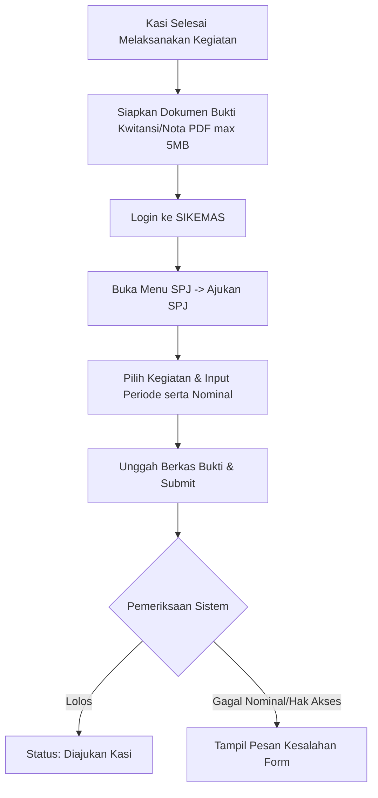
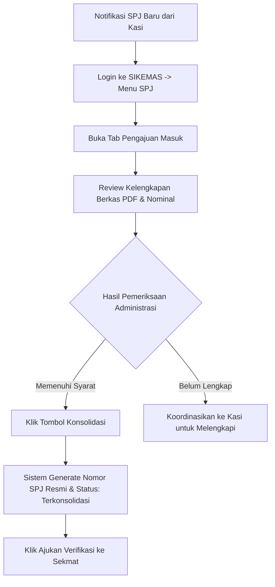
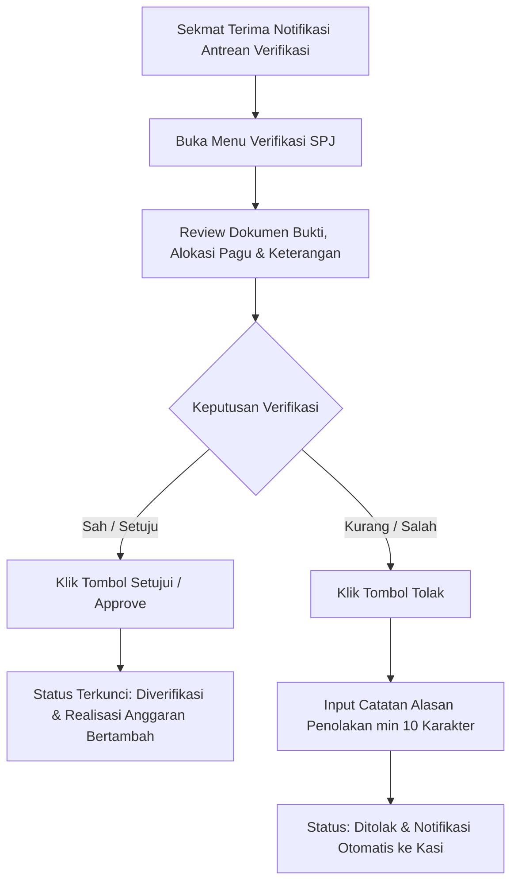
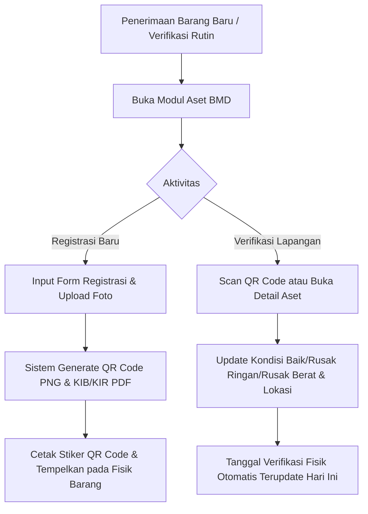

# 📘 STANDAR OPERASIONAL PROSEDUR (SOP) PENGGUNAAN SIMPEL KAN
## SISTEM PENCETAKAN PELAPORAN PEMBELANJAAN KECAMATAN
### KECAMATAN CARINGIN — KABUPATEN GARUT

---

Dokumen ini disusun sebagai panduan operasional baku bagi seluruh aparatur di lingkungan Pemerintah Kecamatan Caringin dalam memanfaatkan aplikasi **SIMPEL KAN** untuk mewujudkan akuntabilitas pengelolaan anggaran kegiatan, tertib administrasi SPJ digital, dan transparansi inventarisasi Barang Milik Daerah (BMD).

---

## 📑 DAFTAR ISI SOP
1. [SOP-01: Prosedur Pengajuan SPJ Kegiatan (Kepala Seksi / Kasi)](#sop-01-prosedur-pengajuan-spj-kegiatan-kasi)
2. [SOP-02: Prosedur Konsolidasi & Penomoran SPJ (Staf Keuangan)](#sop-02-prosedur-konsolidasi--penomoran-spj-staf-keuangan)
3. [SOP-03: Prosedur Verifikasi & Pengesahan SPJ (Sekretaris Kecamatan)](#sop-03-prosedur-verifikasi--pengesahan-spj-sekretaris-kecamatan)
4. [SOP-04: Prosedur Inventarisasi BMD, QR Code & KIB/KIR (Staf Umum)](#sop-04-prosedur-inventarisasi-bmd-qr-code--kibkir-staf-umum)
5. [SOP-05: Prosedur Monitoring Eksekutif & Pengendalian Anggaran (Camat)](#sop-05-prosedur-monitoring-eksekutif--pengendalian-anggaran-camat)

---

## SOP-01: Prosedur Pengajuan SPJ Kegiatan (Kasi)

### 1. Tujuan
Menjamin setiap realisasi belanja kegiatan Seksi didukung dengan berkas pertanggungjawaban yang valid, tidak melebihi sisa pagu anggaran, dan terverifikasi secara berjenjang.

### 2. Penanggung Jawab
- **Pelaksana:** Kepala Seksi (Pemerintahan, Trantib, PMD, Kesra, Pelayanan).
- **Pengawas:** Sekretaris Kecamatan & Staf Keuangan.

### 3. Ketentuan & Batasan Bisnis
1. **BR-SPJ-01:** Kasi hanya berhak mengajukan SPJ untuk kegiatan yang tercatat sebagai wewenang Seksinya.
2. **BR-SPJ-02:** Nominal belanja yang diajukan tidak boleh melampaui sisa pagu anggaran kegiatan bersangkutan.
3. **BR-SPJ-10:** Kasi **DILARANG** membuat pengajuan baru jika masih memiliki SPJ yang berstatus *Ditolak* yang belum diperbaiki.

### 4. Langkah-Langkah Operasional

1. **Persiapan Berkas:** Scan seluruh bukti belanja (nota, kuitansi, daftar hadir, foto kegiatan) menjadi 1 file PDF yang jelas (ukuran maksimal 5 MB).
2. **Login Sistem:** Akses alamat `https://sikemas.caringin.go.id` menggunakan akun NIP/Email Kasi.
3. **Pilih Menu Pengajuan:** Pada Sidebar kiri, pilih menu **SPJ Kegiatan** > **Ajukan SPJ Baru**.
4. **Pengisian Formulir:**
   - Pilih *Kegiatan*: Sistem otomatis memuat daftar kegiatan aktif milik seksi Anda beserta sisa pagu real-time.
   - Masukkan *Periode Bulan & Tahun*.
   - Masukkan *Nominal Belanja*: Perhatikan batas sisa pagu yang tertera di layar.
   - Unggah *File Bukti SPJ*: Lampirkan file PDF yang telah disiapkan.
   - Masukkan *Keterangan Belanja*: Rincian singkat maksud penggunaan belanja.
5. **Kirim Pengajuan:** Klik tombol **Kirim Pengajuan SPJ**. Status SPJ menjadi `diajukan_kasi` dan otomatis masuk ke antrean Bagian Keuangan.
6. **Penanganan Revisi (Jika Ditolak Sekmat):**
   - Periksa notifikasi lonceng di pojok kanan atas.
   - Buka SPJ berstatus `ditolak`, baca bagian **Catatan Koreksi Sekmat**.
   - Lengkapi kekurangan bukti fisik ke Bagian Keuangan agar dapat diproses konsolidasi ulang.

---

## SOP-02: Prosedur Konsolidasi & Penomoran SPJ (Staf Keuangan)

### 1. Tujuan
Memeriksa kelengkapan administrasi belanja, memastikan kepatuhan pajak/standar biaya, menerbitkan nomor register resmi SPJ, dan mengajukan draf final ke Sekmat.

### 2. Penanggung Jawab
- **Pelaksana:** Staf Keuangan / Kasubag Keuangan & Program.
- **Pengawas:** Sekretaris Kecamatan.

### 3. Ketentuan & Batasan Bisnis
1. **BR-SPJ-04:** Penomoran SPJ di-generate otomatis oleh sistem dengan pola standar: `SPJ/{SEKSI}/{BULAN_ROMAWI}/{TAHUN}/{URUT_3DIGIT}`.
2. **BR-KEU-01:** Staf Keuangan tidak memiliki kewenangan menyetujui/mengesahkan SPJ (kewenangan mutlak berada di Sekmat).
3. **BR-KEU-03:** Sistem memunculkan alert jika realisasi anggaran kegiatan telah melampaui **80% dari pagu**.

### 4. Langkah-Langkah Operasional

1. **Pemeriksaan Antrean:** Buka menu **SPJ Masuk**, lihat daftar pengajuan Kasi pada tab *Pengajuan Masuk*.
2. **Uji Berkas:** Klik ikon *Lihat Detail*, unduh/preview dokumen bukti belanja Kasi. Pastikan:
   - Cap basah toko/rekanan dan kuitansi bermaterai sesuai nominal ketentuan.
   - Potongan PPh/PPn telah diperhitungkan jika memenuhi ambang batas belanja kena pajak.
   - Sisa pagu mencukupi.
3. **Konsolidasi & Penomoran:** Klik tombol **Konsolidasi SPJ**. Sistem secara otomatis memberikan nomor register SPJ resmi dan memajukan status ke `dikonsolidasi`.
4. **Pengajuan ke Pimpinan:** Setelah draf nomor terbit, klik **Ajukan Verifikasi ke Sekmat**. Notifikasi otomatis terkirim ke Sekmat.
5. **Pengelolaan Pagu & Laporan:**
   - Memantau peringatan banner kegiatan > 80% pada dashboard.
   - Mengunduh rekapitulasi realisasi belanja berkala via menu **Laporan** format Excel atau PDF.

---

## SOP-03: Prosedur Verifikasi & Pengesahan SPJ (Sekretaris Kecamatan)

### 1. Tujuan
Memberikan kepastian hukum dan pengesahan pencairan anggaran belanja melalui mekanisme verifikasi tunggal satu tahap (*single-stage approval*).

### 2. Penanggung Jawab
- **Pelaksana:** Sekretaris Kecamatan (Sekmat).
- **Laporan ke:** Camat.

### 3. Ketentuan & Batasan Bisnis
1. **BR-SPJ-05:** Penolakan SPJ **WAJIB** menyertakan catatan alasan penolakan minimal 10 karakter.
2. **BR-SPJ-06:** SPJ yang telah diverifikasi berstatus `diverifikasi` bersifat **Kekal (IMMUTABLE)** — tidak dapat diedit atau dihapus.
3. **BR-SPJ-07:** Realisasi anggaran kegiatan baru bertambah secara efektif setelah status SPJ menjadi `diverifikasi`.

### 4. Langkah-Langkah Operasional

1. **Melihat Antrean:** Buka menu **Verifikasi SPJ** pada Sidebar. Sistem menampilkan jumlah antrean yang memerlukan persetujuan.
2. **Telaah Dokumen:** Klik baris SPJ untuk meninjau rincian kegiatan, nominal, nama Kasi pengaju, serta dokumen lampiran.
3. **Pengambilan Keputusan:**
   - **Jika Sah (Approve):** Klik tombol hijau **Setujui SPJ**. Konfirmasi dialog modal. Status seketika berubah menjadi `diverifikasi`, nilai realisasi terserap otomatis, dan notifikasi konfirmasi dikirim ke Kasi dan Staf Keuangan.
   - **Jika Ditolak (Reject):** Klik tombol merah **Tolak SPJ**. Masukkan alasan penolakan pada kotak teks yang muncul (contoh: *"Kwitansi nomor 04 belum distempel basah dan daftar hadir belum lengkap"*). Klik **Simpan Penolakan**.
4. **Monitoring Berkala:** Pantau serapan belanja per seksi di dashboard guna mencegah penumpukan belanja di akhir tahun anggaran.

---

## SOP-04: Prosedur Inventarisasi BMD, QR Code & KIB/KIR (Staf Umum)

### 1. Tujuan
Memastikan seluruh aset fisik Barang Milik Daerah (BMD) tercatat dengan kodefikasi baku, memiliki label QR Code fisik, memiliki kartu inventaris (KIB/KIR), dan diverifikasi fisik secara periodik.

### 2. Penanggung Jawab
- **Pelaksana:** Staf Umum / Pengurus Barang Kecamatan.
- **Pengawas:** Sekretaris Kecamatan.

### 3. Ketentuan & Batasan Bisnis
1. **BR-ASET-01:** Kode barang wajib mengikuti format baku: `{GOLONGAN}.{SUB}/{URUT_4DIGIT}/{TAHUN}`.
2. **BR-ASET-02:** Aset dengan kondisi `rusak_berat` otomatis diklasifikasikan sebagai *Kandidat Usulan Penghapusan*.
3. **BR-ASET-03:** Setiap penambahan aset baru otomatis men-generate file gambar QR Code PNG yang mengarah ke link publik detail aset.
4. **BR-ASET-05:** Setiap pembaruan kondisi atau lokasi fisik aset otomatis memperbarui `tanggal_verifikasi_fisik` ke tanggal hari ini.
5. **BR-ASET-06:** Data aset dilarang dihapus dari sistem (No Delete Policy).

### 4. Langkah-Langkah Operasional

1. **Pendaftaran Aset Baru:**
   - Klik tombol **Tambah Aset Baru** di `/aset/create`.
   - Isi form identitas barang, golongan, nomor register, merk/type, nilai perolehan, lokasi ruangan, dan nama penanggung jawab.
   - Lampirkan foto fisik aset beresolusi jelas (maksimal 2 MB).
   - Klik **Simpan Aset**.
2. **Pencetakan Label QR Code:**
   - Buka detail aset yang baru disimpan.
   - Klik tombol **Unduh Label QR**. Sistem mengunduh gambar PNG kode QR.
   - Cetak label pada stiker vinyl tahan air dan tempelkan pada fisik barang di posisi yang mudah dipindai.
3. **Pencetakan Kartu Inventaris:**
   - Klik tombol **Unduh KIB / KIR (PDF)** untuk mencetak lembar inventaris resmi ruangan ber-kop Kecamatan Caringin.
   - Pasang KIR pada pigura di setiap ruangan kantor kecamatan.
4. **Verifikasi Fisik Berkala (Maksimal 90 Hari):**
   - Lakukan inspeksi fisik ke seluruh ruangan kecamatan minimal sekali per triwulan.
   - Pindai label QR pada barang menggunakan kamera smartphone atau buka langsung menu Aset.
   - Jika terjadi mutasi ruangan atau penurunan kondisi (misal dari *Baik* ke *Rusak Ringan*), perbarui data melalui modal **Verifikasi Fisik**.
   - Sistem secara otomatis mencatat riwayat mutasi pada tabel jejak audit (`log_aktivitas`).

---

## SOP-05: Prosedur Monitoring Eksekutif & Pengendalian Anggaran (Camat)

### 1. Tujuan
Menyediakan visibilitas tingkat tinggi bagi Camat untuk mengontrol laju penyerapan anggaran, mengevaluasi kinerja masing-masing Seksi, dan memantau kondisi aset wilayah kerja.

### 2. Penanggung Jawab
- **Pelaksana:** Camat Caringin (Kepala Wilayah).

### 3. Ketentuan & Batasan Bisnis
1. Mode akses akun Camat bersifat **Read-Only (Monitoring)**. Camat tidak membuat entri SPJ atau mutasi aset untuk menjaga pemisahan fungsi (*segregation of duties*).
2. Data yang disajikan pada dashboard Camat adalah data agregat **real-time** yang diambil langsung dari transaksi sah yang telah diverifikasi.

### 4. Langkah-Langkah Operasional
1. **Akses Dashboard Eksekutif:** Login menggunakan akun Camat di `https://sikemas.caringin.go.id`.
2. **Evaluasi Penyerapan Anggaran:**
   - Tinjau indikator utama di bagian atas: *Total Pagu*, *Total Realisasi*, *Sisa Anggaran*, dan *Persentase Serapan Kumulatif*.
   - Evaluasi apakah penyerapan anggaran sejalan dengan target triwulanan (Q1-Q4).
3. **Evaluasi Kinerja Antar-Seksi:**
   - Periksa diagram batang **Performa Penyerapan per Seksi**.
   - Identifikasi seksi dengan penyerapan lambat (< 50% di semester kedua) atau seksi dengan peringatan mendekati batas pagu (> 80%).
   - Jadwalkan rapat koordinasi internal jika ditemukan deviasi belanja yang signifikan.
4. **Pengawasan Aset Daerah:**
   - Tinjau diagram lingkaran status kondisi aset BMD.
   - Pantau aset yang berstatus *Rusak Berat* untuk persiapan surat usulan penghapusan aset ke Badan Pengelolaan Keuangan dan Aset Daerah (BPKAD) Kabupaten Garut.
5. **Penerbitan Rekapitulasi Laporan:**
   - Buka menu **Laporan** untuk mengunduh berkas rekapitulasi semesteran format PDF/Excel sebagai bahan laporan evaluasi ke Bupati Garut.
